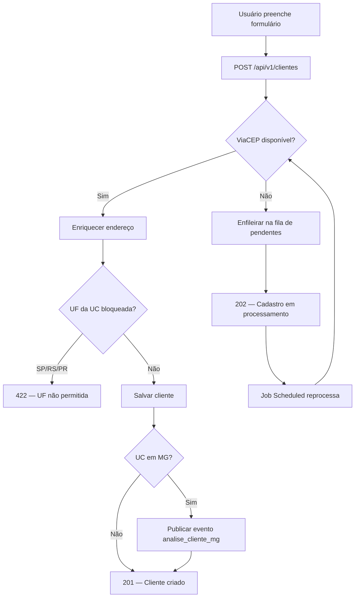
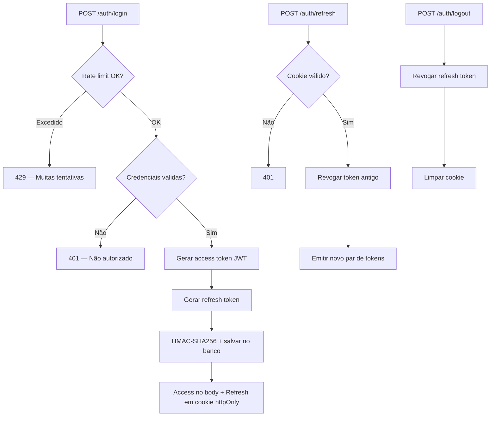
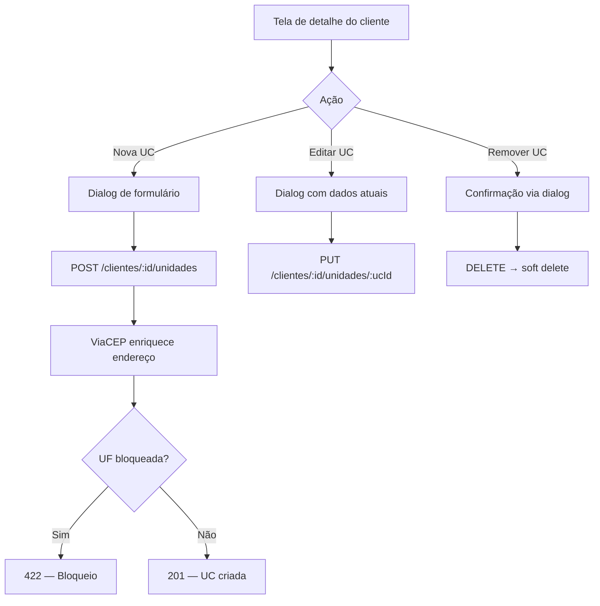
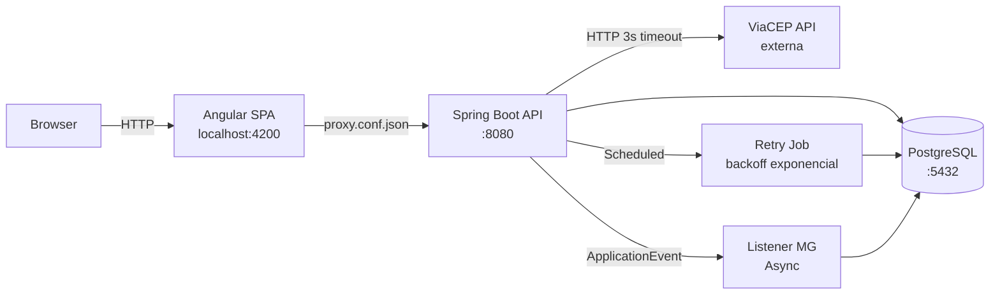

# Voltz — Gestão de Clientes

Sistema fullstack para **gestão de clientes e unidades consumidoras**. Um cliente (pessoa física ou jurídica) pode ter várias unidades consumidoras (instalações). O sistema cobre o ciclo completo: cadastrar, editar, listar, consultar e inativar — com regras de negócio, integração com ViaCEP e segurança JWT.

> **Documentação técnica detalhada:** [`TECHNICAL.md`](TECHNICAL.md)
> **Especificação original:** [`docs/PLANO-ORIGINAL.md`](docs/PLANO-ORIGINAL.md)

---

## O que a aplicação faz

### Funcionalidades
- Cadastrar, editar, listar (paginado com busca), consultar e **inativar** clientes (exclusão lógica)
- Gerenciar **unidades consumidoras** independentemente (adicionar, editar, remover)
- Exibir os **últimos 20** clientes
- **Correção de documento** restrita a administradores, com auditoria completa
- **Tema claro/escuro** com persistência em localStorage

### Regras de negócio
- **Documento único** (CPF/CNPJ válidos com dígitos verificadores)
- **Unidade consumidora** não pode pertencer a dois clientes
- **Endereço preenchido pelo CEP** (ViaCEP)
- **Bloqueia** unidades em **SP, RS ou PR**
- Unidade em **MG** dispara um **evento** para análise futura

### Resiliência
- Se a consulta de CEP estiver fora do ar, o cadastro **não se perde**: entra numa **fila** e é processado automaticamente quando o serviço volta
- **Indicador na interface** mostrando se a consulta de CEP está disponível

---

## Como funciona

### Fluxo de cadastro de cliente



### Fluxo de autenticação



### Fluxo de gestão de UCs (independente)



---

## Stack

| Camada | Tecnologia | Por que |
|--------|-----------|---------|
| Backend | **Kotlin + Spring Boot 3.5** | Conciso, seguro, ecossistema maduro |
| Build | **Maven** | Exigido pelo enunciado |
| Dados | **PostgreSQL 16 + JPA/Hibernate** | Banco real, ORM padrão |
| Schema | **Flyway** (5 migrations) | Histórico versionado do banco |
| Segurança | **Spring Security + JWT (OAuth2 Resource Server)** | Stateless, padrão para SPA + API |
| Rate Limit | **bucket4j** | 5 tentativas / 15 min por IP no login |
| Frontend | **Angular 19 standalone + Material** | Moderno, sem módulos, UI consistente |
| Design System | **Bolt Energy DS** (tokens CSS + tema claro/escuro) | Identidade visual profissional |
| Infra dev | **Docker** | Nada instalado além do Docker; ambiente reproduzível |

---

## Como rodar

**Pré-requisito:** Docker Desktop + git.

```bash
# 1. Clonar e configurar
cp .env.example .env

# 2. Subir tudo (banco + backend + frontend)
docker compose up -d --build

# 3. Acessar
# Frontend: http://localhost:4200
# Swagger:  http://localhost:4200/swagger-ui/index.html
# Login:    admin / admin123
```

### Com dados de demonstração

Para iniciar com o banco populado (10 clientes, 13 UCs, pendentes e análises MG):

```bash
# No .env, adicione:
APP_DEMO_SEED=true

# Ou passe direto:
APP_DEMO_SEED=true docker compose up -d --build
```

O seeder é **idempotente** — só roda se o banco estiver vazio (sem clientes). Para resetar, apague o volume: `docker compose down -v && docker compose up -d --build`.

### Dados do seeder

| Tipo | Quantidade | Detalhe |
|------|-----------|---------|
| Clientes ativos | 9 | CPFs e CNPJs variados, cidades diversas |
| Clientes inativos | 1 | Ana Beatriz (SP) — para testar toggle |
| UCs em MG | 5 | Geram análises MG automaticamente |
| UCs em outros estados | 8 | RJ, BA, DF, CE |
| Pendentes (PENDENTE) | 1 | Para visualizar na fila |
| Pendentes (REJEITADO) | 2 | UF bloqueada (PR, SP) |
| Pendentes (PROCESSADO) | 1 | Já finalizado |
| Pendentes (FALHA) | 1 | TTL expirado |
| Análises MG | 5 | Todas PENDENTE_ANALISE |

---

## Arquitetura



### Backend (camadas)
```
controller → service → repository → database
     ↓           ↓
   DTOs    regras de negócio
             (finalizarCadastro = fonte única UF)
```

### Frontend (estrutura)
```
app/
├── core/         → services, guards, interceptors, models, theme
├── features/     → auth, clientes, pendentes, analise-mg
├── shared/       → avatar, badge, callout, confirm-dialog, empty-state,
│                   endereco-form, skeleton, viacep-badge, pipes
└── layout/       → shell (sidebar escura + topbar + theme toggle)
```

---

## Design System — Bolt Energy

O frontend usa um design system próprio com:

- **Tokens CSS** (`_tokens.scss`) — 70+ variáveis para cores, tipografia, sombras, raios
- **Tema claro/escuro** — Alternância via `data-theme` no HTML, persistido em localStorage
- **Fontes** — Space Grotesk (títulos) + Manrope (corpo)
- **Sidebar sempre escura** com logo, navegação com indicador menta e badge ViaCEP
- **Overrides do Angular Material** — Todos os componentes mapeados para tokens (nunca hex solto)

Componentes do DS: Avatar (iniciais + cor determinística), StatusBadge (dot + texto semântico), ConfirmDialog (substitui window.confirm), Callout (balão informativo), Skeleton (shimmer loading), EmptyState (ícone + título + subtítulo).

---

## Decisões de arquitetura

### Por que exclusão lógica?
Apagar perde histórico. "Remover" marca como **inativo** — o dado fica para auditoria, e a tela mostra o status com toggle.

### Por que a fila quando o ViaCEP cai?
O endereço é confirmado pelo backend. Se a API externa cair, o cadastro entra numa fila e é finalizado automaticamente quando o serviço volta. Não perde o cadastro do usuário.

### Por que endpoints separados para UC?
Editar uma UC sem mexer no cliente (e vice-versa). Cada entidade com seu ciclo de vida. Formulários mais simples e focados. Proteção de concorrência (`@Version`) independente.

### Por que HMAC-SHA256 no refresh token?
SHA-256 puro é vulnerável a rainbow tables se o banco for comprometido. HMAC-SHA256 com a chave JWT como secret garante que só quem tem o secret pode gerar/verificar hashes.

### Por que TransactionTemplate no retry job?
Cada item da fila precisa de transação independente. Se um falha, os outros não são afetados. `TransactionTemplate` resolve o problema de self-invocation do proxy Spring.

### Por que `Endereco.enriquecerCom()` no domínio?
A lógica de copiar campos do ViaCEP existia em 3 serviços. Centralizar no model elimina duplicação e mantém o domínio rico.

### Por que `requireNotNull` em vez de `!!`?
`!!` lança `KotlinNullPointerException` sem mensagem. `requireNotNull` permite mensagem descritiva e é o padrão idiomático Kotlin.

### Por que repositórios retornam `T?` em vez de `Optional`?
Spring Data com Kotlin suporta null safety nativo. `T?` + `?: throw` é mais idiomático que `.orElseThrow {}`.

---

## Histórico de decisões

| Data | Decisão | Mudança | Motivo |
|------|---------|---------|--------|
| 2026-06-04 | D14 (Cliente↔UC) | cascade ALL + **soft delete na UC** | Inativar cliente não apaga UCs |
| 2026-06-04 | D21 (ViaCEP fora do ar) | **Fila persistente + retry** | Não perder cadastro; nunca confiar no cliente |
| 2026-06-05 | Proxy de dev | nginx → **Angular CLI proxy** | Solução padrão, zero containers extras |
| 2026-06-05 | Swagger | **Controlado por Spring profile** | Dev público, prod protegido |
| 2026-06-05 | Cookie secure | **`request.isSecure`** | Automático (HTTP→false, HTTPS→true) |
| 2026-06-05 | JWT key | **Bean centralizado + fail fast** | Sem duplicação, require ≥ 32 bytes |
| 2026-06-05 | Rate limiting | **bucket4j** no login | 5/15min por IP, 429 Too Many Requests |
| 2026-06-05 | UC endpoints | **CRUD independente** do Cliente | Editar UC sem mexer no cliente |
| 2026-06-05 | Auditoria documento | **Tabela `auditoria_documento`** | Quem/quando/de/para/motivo |
| 2026-06-05 | Frontend shared | **Pipes + components reutilizáveis** | DRY, loading/error/empty states |
| 2026-06-05 | Design System | **Bolt Energy DS** | Tokens CSS, tema claro/escuro, sidebar escura |
| 2026-06-05 | Refresh token | SHA-256 → **HMAC-SHA256** | Rainbow table protection |
| 2026-06-05 | Retry job | **TransactionTemplate** por item | Isolamento transacional |
| 2026-06-05 | Endereço DRY | **`enriquecerCom()`** no model | Eliminar duplicação em 3 serviços |
| 2026-06-05 | Kotlin idiomático | **`requireNotNull`** + **`T?`** repos | Null safety nativa, sem `!!` |
| 2026-06-05 | UC timestamps | **createdAt/updatedAt** + V5 migration | Auditoria temporal nas UCs |
| 2026-06-05 | Seeder demo | **`APP_DEMO_SEED=true`** opcional | Dados prontos para demonstração |
