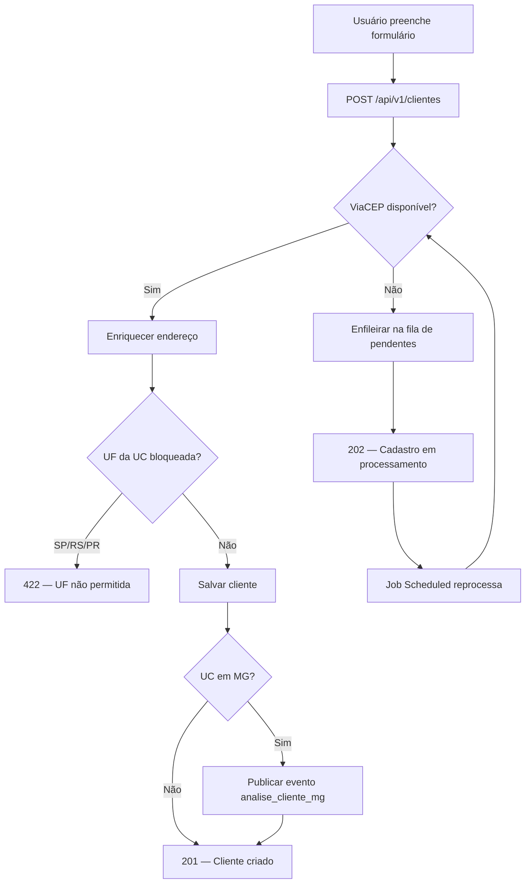
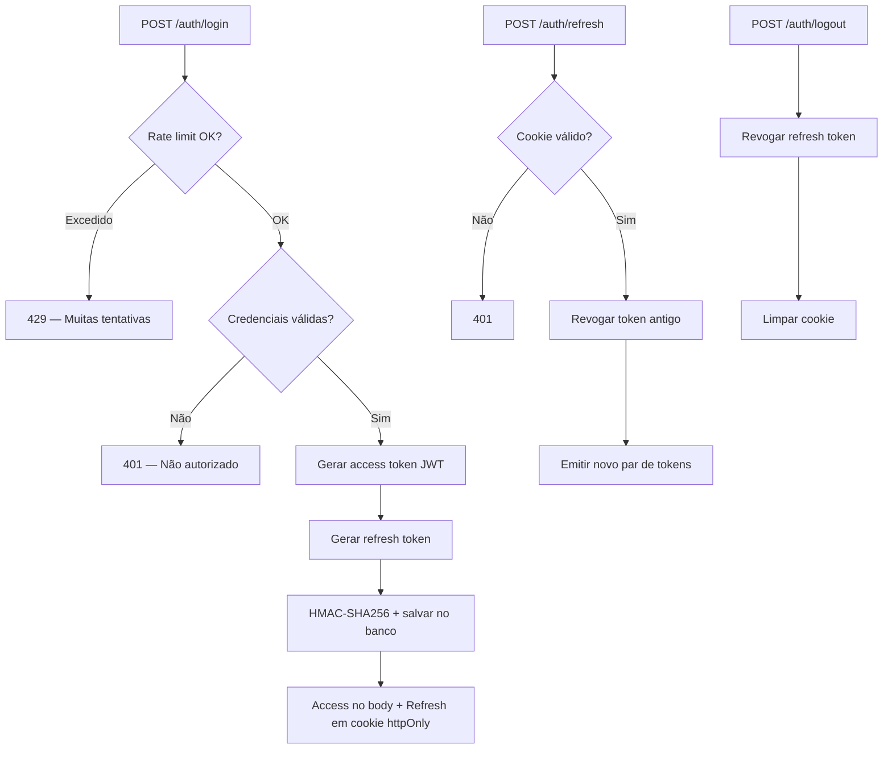
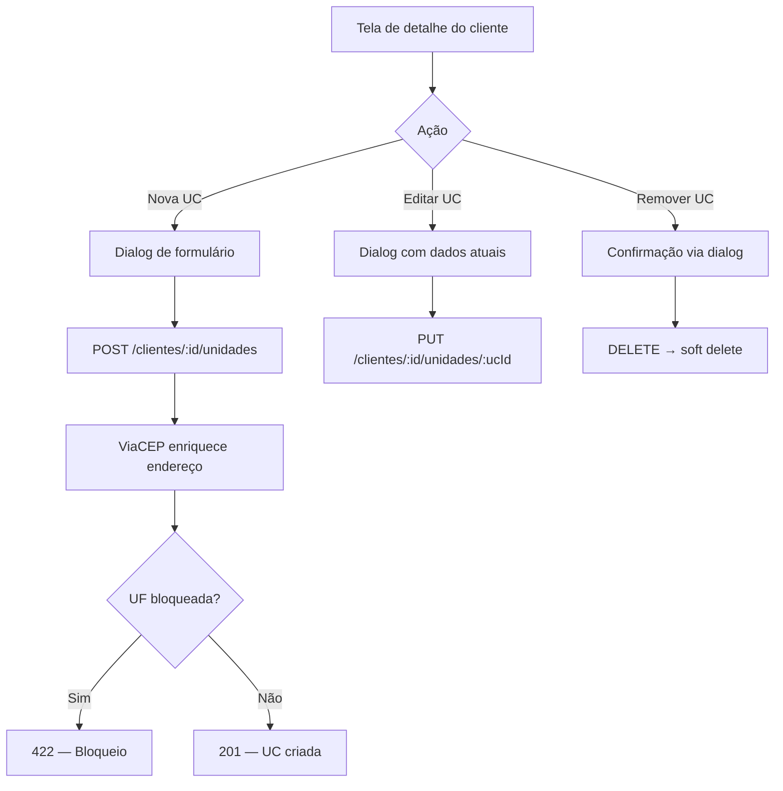
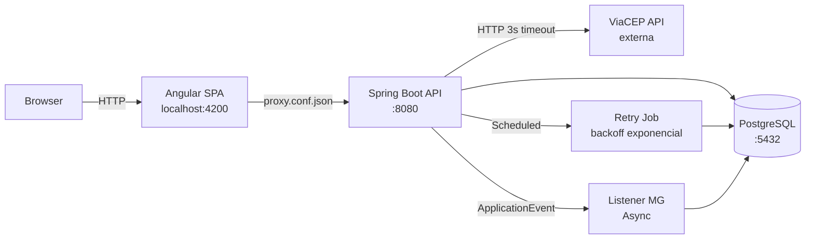

# Voltz — Gestão de Clientes

Sistema fullstack para **gestão de clientes e unidades consumidoras**. Um cliente (pessoa física ou jurídica) pode ter várias unidades consumidoras (instalações). O sistema cobre o ciclo completo: cadastrar, editar, listar, consultar e inativar — com regras de negócio, integração com ViaCEP e segurança JWT.

> **Documentação técnica detalhada:** [`TECHNICAL.md`](TECHNICAL.md)
> **Especificação original:** [`docs/PLANO-ORIGINAL.md`](docs/PLANO-ORIGINAL.md)

---

## O que a aplicação faz

### Funcionalidades
- Cadastrar, editar, listar (paginado com busca), consultar e **inativar** clientes (exclusão lógica)
- Gerenciar **unidades consumidoras** independentemente (adicionar, editar, remover)
- Exibir os **últimos 20** clientes
- **Correção de documento** restrita a administradores, com auditoria completa
- **Tema claro/escuro** com persistência em localStorage

### Regras de negócio
- **Documento único** (CPF/CNPJ válidos com dígitos verificadores)
- **Unidade consumidora** não pode pertencer a dois clientes
- **Endereço preenchido pelo CEP** (ViaCEP)
- **Bloqueia** unidades em **SP, RS ou PR**
- Unidade em **MG** dispara um **evento** para análise futura

### Resiliência
- Se a consulta de CEP estiver fora do ar, o cadastro **não se perde**: entra numa **fila** e é processado automaticamente quando o serviço volta
- **Indicador na interface** mostrando se a consulta de CEP está disponível

---

## Como funciona

### Fluxo de cadastro de cliente



### Fluxo de autenticação



### Fluxo de gestão de UCs (independente)



---

## Stack

| Camada | Tecnologia | Por que |
|--------|-----------|---------|
| Backend | **Kotlin + Spring Boot 3.5** | Conciso, seguro, ecossistema maduro |
| Build | **Maven** | Exigido pelo enunciado |
| Dados | **PostgreSQL 16 + JPA/Hibernate** | Banco real, ORM padrão |
| Schema | **Flyway** (5 migrations) | Histórico versionado do banco |
| Segurança | **Spring Security + JWT (OAuth2 Resource Server)** | Stateless, padrão para SPA + API |
| Rate Limit | **bucket4j** | 5 tentativas / 15 min por IP no login |
| Frontend | **Angular 19 standalone + Material** | Moderno, sem módulos, UI consistente |
| Design System | **Bolt Energy DS** (tokens CSS + tema claro/escuro) | Identidade visual profissional |
| Infra dev | **Docker** | Nada instalado além do Docker; ambiente reproduzível |

---

## Como rodar

**Pré-requisito:** Docker Desktop + git.

```bash
# 1. Clonar e configurar
git clone git@github.com:LuizGGoncalves/Voltz.git
cd Voltz
cp .env.example .env

# 2. Subir tudo (banco + backend + frontend)
docker compose up -d --build

# 3. Acessar
open http://localhost:4200
```

### Primeiro acesso

| | |
|-|-|
| **Frontend** | [http://localhost:4200](http://localhost:4200) |
| **Swagger (API docs)** | [http://localhost:4200/swagger-ui/index.html](http://localhost:4200/swagger-ui/index.html) |
| **Usuário** | `admin` |
| **Senha** | `admin123` |

> O usuário `admin` tem roles ADMIN e USER — acesso total a todas as funcionalidades.

### Com dados de demonstração

Para iniciar com o banco populado (10 clientes, 13 UCs, pendentes e análises MG):

```bash
# No .env, adicione:
APP_DEMO_SEED=true

# Ou passe direto:
APP_DEMO_SEED=true docker compose up -d --build
```

O seeder é **idempotente** — só roda se o banco estiver vazio (sem clientes). Para resetar, apague o volume: `docker compose down -v && docker compose up -d --build`.

### Dados do seeder

| Tipo | Quantidade | Detalhe |
|------|-----------|---------|
| Clientes ativos | 32 | CPFs e CNPJs variados, cidades em MG/RJ/SP/BA/DF/CE/PA/PE/PR |
| Clientes inativos | 10 | Para testar filtro "Inativos" |
| UCs em MG | 10 | Geram análises MG automaticamente |
| UCs em outros estados | 9 | RJ, BA, DF, CE |
| Pendentes (PENDENTE) | 8 | Aguardando ViaCEP |
| Pendentes (REJEITADO) | 10 | UF bloqueada (SP, RS, PR) |
| Pendentes (PROCESSADO) | 7 | Com link para o cliente criado |
| Pendentes (FALHA) | 7 | TTL expirado ou max tentativas |
| Análises MG | 10 | Todas PENDENTE_ANALISE |
| **Total** | **42 clientes + 32 pendentes** | **Paginação visível em todas as telas** |

---

## Arquitetura



### Backend (camadas)
```
controller → service → repository → database
     ↓           ↓
   DTOs    regras de negócio
             (finalizarCadastro = fonte única UF)
```

### Frontend (estrutura)
```
app/
├── core/         → services, guards, interceptors, models, theme
├── features/     → auth, clientes, pendentes, analise-mg
├── shared/       → avatar, badge, callout, confirm-dialog, empty-state,
│                   endereco-form, skeleton, viacep-badge, pipes
└── layout/       → shell (sidebar escura + topbar + theme toggle)
```

---

## Design System — Bolt Energy

O frontend usa um design system próprio com:

- **Tokens CSS** (`_tokens.scss`) — 70+ variáveis para cores, tipografia, sombras, raios
- **Tema claro/escuro** — Alternância via `data-theme` no HTML, persistido em localStorage
- **Fontes** — Space Grotesk (títulos) + Manrope (corpo)
- **Sidebar sempre escura** com logo, navegação com indicador menta e badge ViaCEP
- **Overrides do Angular Material** — Todos os componentes mapeados para tokens (nunca hex solto)

Componentes do DS: Avatar (iniciais + cor determinística), StatusBadge (dot + texto semântico), ConfirmDialog (substitui window.confirm), Callout (balão informativo), Skeleton (shimmer loading), EmptyState (ícone + título + subtítulo).

---

## Decisões técnicas

### Backend — Kotlin + Spring Boot

| Decisão | Escolha | Motivo |
|---------|---------|--------|
| Linguagem | **Kotlin** (não Java) | Null safety nativa, data classes para DTOs, extension functions para mappers. Enunciado permite "Java ou Kotlin" |
| Entidades JPA | **Classes normais** (nunca data class) | JPA exige identidade por referência. Data classes geram equals/hashCode por todos os campos, quebrando lazy loading |
| Migrations | **Flyway + `ddl-auto: validate`** | Schema versionado no Git, imutável após aplicado. Hibernate só valida — nunca altera o banco |
| Documento | **Value Object** com validação L2 | CPF/CNPJ validado com dígitos verificadores, normalizado (só dígitos), tipo derivado do tamanho |
| Endereço | **`@Embeddable`** reutilizado | Sem tabela extra. Campos inline com prefixo. Usado em Cliente e UC |
| Soft delete | **`@SQLDelete`** + índice parcial | `repository.delete()` executa UPDATE transparentemente. UNIQUE WHERE ativo=true permite recadastro |
| JWT | **OAuth2 Resource Server** | Validação nativa (signature, issuer, expiration). Sem filtro manual frágil |
| Refresh token | **HMAC-SHA256** (não SHA-256 puro) | Proteção contra rainbow tables. Chave JWT como secret do HMAC |
| Retry job | **TransactionTemplate** por item | Self-invocation ignora proxy transacional. Cada item em transação independente |
| Enriquecimento | **`Endereco.enriquecerCom()`** | Lógica de copiar campos do ViaCEP centralizada no model (era duplicada em 3 services) |
| Null safety | **`requireNotNull()`** (não `!!`) | Mensagem descritiva em vez de KotlinNullPointerException silenciosa |
| Repositórios | **`T?`** (não `Optional<T>`) | Spring Data suporta null safety nativa do Kotlin. Mais idiomático |
| Exclusão lógica | **Flag `ativo`** + toggle na UI | Preserva dados para auditoria. Toggle "Ativos / Inativos / Todos" na listagem |
| Rate limiting | **bucket4j** (5/15min por IP) | Proteção contra brute force no login. Extensível para outros endpoints |
| Defesa em profundidade | **SecurityConfig + @PreAuthorize** | Duas camadas independentes. Se uma falha, a outra protege |
| Profiles | **dev / test / prod** | Swagger público em dev, protegido em prod. Cookie secure automático. CORS configurável |

### Frontend — Angular + Design System

| Decisão | Escolha | Motivo |
|---------|---------|--------|
| Componentes | **Standalone** (sem NgModules) | Padrão Angular 17+. Imports explícitos, lazy loading direto, tree-shaking melhor |
| Estado | **Signals** + RxJS para HTTP | Signals: estado síncrono de UI (loading, erro). RxJS: chamadas assíncronas |
| Design System | **CSS custom properties** | Tema claro/escuro com `data-theme`. Nenhum hex solto. Overrides do Material via tokens |
| Sidebar | **Sempre escura** | Padrão de apps de gestão (GitHub, Linear). Contraste com conteúdo |
| Confirmação | **MatDialog** (não window.confirm) | Não-bloqueante, estilizável, com ícone contextual e botão de ação semântico |
| Validação CPF/CNPJ | **Validator custom** no frontend | Algoritmo completo de dígitos verificadores. Feedback imediato antes de enviar ao backend |
| Seeder | **`APP_DEMO_SEED=true`** opcional | Idempotente. Demo com 42 clientes, 19 UCs, 32 pendentes, 10 análises MG |
| Ordenação | **`?sort=` nativo do Pageable** | Select no frontend (Nome A-Z, Z-A, Mais recentes, Mais antigos). Sem endpoint extra |

---

## Histórico de decisões

| Data | Decisão | Mudança | Motivo |
|------|---------|---------|--------|
| 2026-06-04 | Cliente↔UC | cascade ALL + **soft delete na UC** | Inativar cliente não apaga UCs |
| 2026-06-04 | ViaCEP fora do ar | **Fila persistente + retry** | Não perder cadastro; never trust the client |
| 2026-06-05 | Proxy de dev | nginx → **Angular CLI proxy** | Solução padrão, zero containers extras |
| 2026-06-05 | Swagger | **Controlado por Spring profile** | Dev público, prod protegido |
| 2026-06-05 | Cookie secure | **`request.isSecure`** | Automático (HTTP→false, HTTPS→true) |
| 2026-06-05 | JWT key | **Bean centralizado + fail fast** | Sem duplicação, require ≥ 32 bytes |
| 2026-06-05 | Rate limiting | **bucket4j** no login | 5/15min por IP, 429 Too Many Requests |
| 2026-06-05 | UC endpoints | **CRUD independente** do Cliente | Editar UC sem mexer no cliente |
| 2026-06-05 | Auditoria | **Tabela `auditoria_documento`** | Quem/quando/de/para/motivo |
| 2026-06-05 | Frontend shared | **Pipes + components reutilizáveis** | DRY, loading/error/empty states |
| 2026-06-05 | Design System | **Bolt Energy DS** (tokens + tema) | Identidade visual, claro/escuro, sidebar escura |
| 2026-06-05 | Refresh token | SHA-256 → **HMAC-SHA256** | Rainbow table protection |
| 2026-06-05 | Retry job | **TransactionTemplate** por item | Isolamento transacional (self-invocation fix) |
| 2026-06-05 | Endereço DRY | **`enriquecerCom()`** no model | Duplicação eliminada em 3 services |
| 2026-06-05 | Kotlin idiomático | **`requireNotNull`** + **`T?`** repos | Null safety nativa, padrão Spring Data Kotlin |
| 2026-06-05 | UC timestamps | **createdAt/updatedAt** + V5 | Auditoria temporal nas UCs |
| 2026-06-05 | Seeder demo | **`APP_DEMO_SEED=true`** | 42 clientes, 32 pendentes, 10 análises MG |
| 2026-06-05 | Pendente→Cliente | **`cliente_id`** + V6 migration | Link navegável quando PROCESSADO |
| 2026-06-05 | Filtro status | **`filtroStatus`** (ativos/inativos/todos) | Substituiu boolean incluirInativos |
| 2026-06-05 | Ordenação | **`?sort=`** nativo do Pageable | Removeu endpoint `/ultimos` redundante |
| 2026-06-05 | Validação frontend | **documentoValidator** (CPF/CNPJ) | Dígitos verificadores no client-side |
| 2026-06-05 | Swagger enriquecido | **`@Operation` + `@Tag`** em todos endpoints | Documentação completa da API |
| 2026-06-06 | Revisão v2 | **20 decisões técnicas documentadas** | Motivação técnica de cada escolha |
