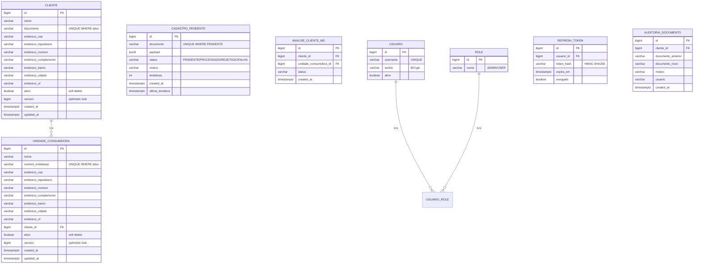
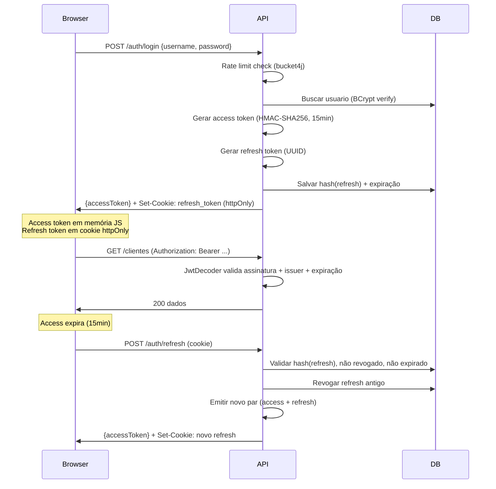
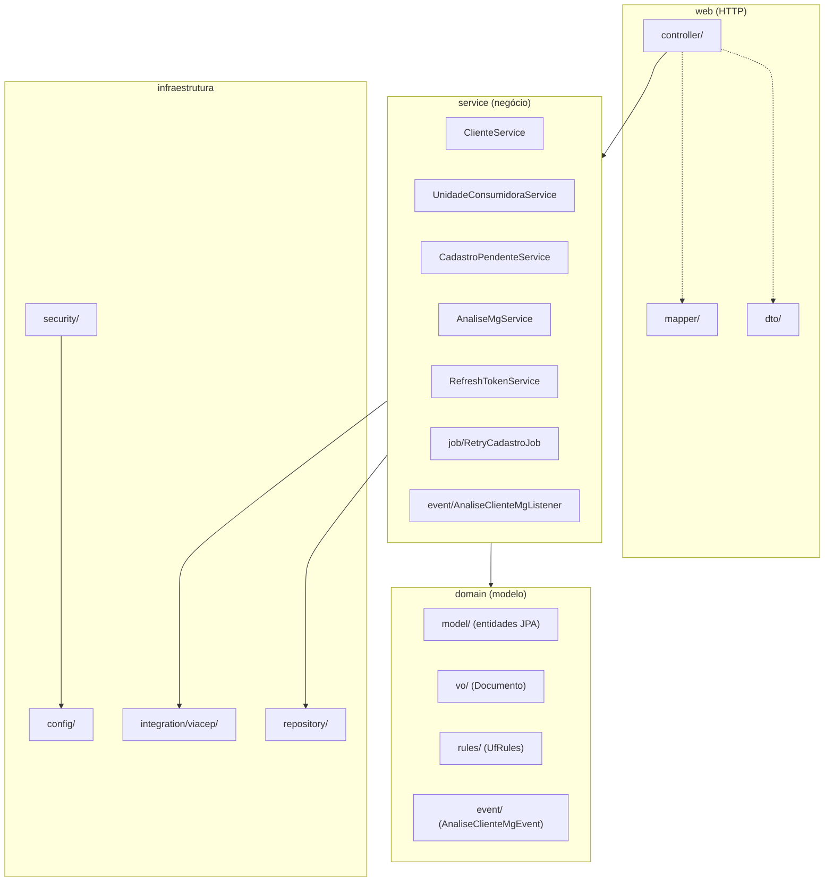
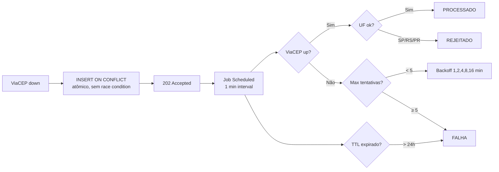
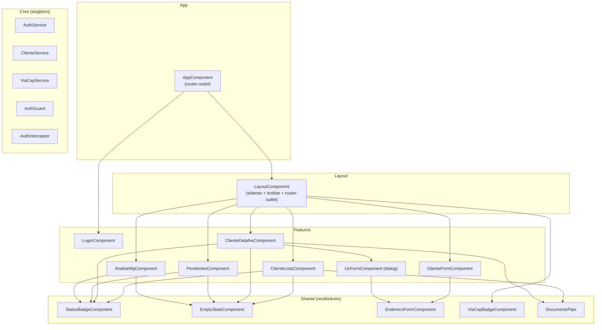

# Documentação Técnica — Voltz (Gestão de Clientes)

> Documento completo de referência técnica. Para visão geral do produto, ver [`README.md`](README.md).

---

## 1. Modelo de Dados



### Índices parciais (PostgreSQL)
```sql
UNIQUE(documento) WHERE ativo = TRUE          -- cliente
UNIQUE(numero_instalacao) WHERE ativo = TRUE   -- unidade_consumidora
UNIQUE(documento) WHERE status = 'PENDENTE'    -- cadastro_pendente
```

### Migrations
| Versão | Descrição |
|--------|-----------|
| V1 | Schema inicial: todas as tabelas + seed admin |
| V2 | Fix hash BCrypt do admin |
| V3 | Adicionar `version` na unidade_consumidora |
| V4 | Tabela `auditoria_documento` |
| V5 | Adicionar `created_at`/`updated_at` na unidade_consumidora |

---

## 2. API REST

### Autenticação
| Método | Rota | Acesso | Descrição |
|--------|------|--------|-----------|
| POST | `/api/v1/auth/login` | Público | Login → access token + cookie refresh |
| POST | `/api/v1/auth/refresh` | Público | Renovar tokens via cookie |
| POST | `/api/v1/auth/logout` | Autenticado | Revogar refresh + limpar cookie |

### Clientes
| Método | Rota | Role | Descrição |
|--------|------|------|-----------|
| POST | `/api/v1/clientes` | USER | Criar (201) ou enfileirar (202) |
| PUT | `/api/v1/clientes/{id}` | USER | Atualizar dados do cliente (sem UCs) |
| GET | `/api/v1/clientes/{id}` | Autenticado | Buscar por ID com UCs |
| GET | `/api/v1/clientes` | Autenticado | Listar paginado (?incluirInativos) |
| GET | `/api/v1/clientes/ultimos` | Autenticado | Últimos 20 ativos |
| PATCH | `/api/v1/clientes/{id}/documento` | ADMIN | Corrigir documento (com auditoria) |
| DELETE | `/api/v1/clientes/{id}` | ADMIN | Soft delete |

### Unidades Consumidoras
| Método | Rota | Role | Descrição |
|--------|------|------|-----------|
| GET | `/api/v1/clientes/{id}/unidades` | USER | Listar UCs do cliente |
| POST | `/api/v1/clientes/{id}/unidades` | USER | Adicionar UC |
| PUT | `/api/v1/clientes/{id}/unidades/{ucId}` | USER | Editar UC |
| DELETE | `/api/v1/clientes/{id}/unidades/{ucId}` | ADMIN | Soft delete UC |

### Pendentes, Análises e Integrações
| Método | Rota | Acesso | Descrição |
|--------|------|--------|-----------|
| GET | `/api/v1/cadastros-pendentes` | Autenticado | Listar fila (?status) |
| GET | `/api/v1/cadastros-pendentes/{id}` | Autenticado | Status de um pendente |
| GET | `/api/v1/analises-mg` | Autenticado | Listar eventos MG |
| GET | `/api/v1/integracoes/viacep/status` | Público | Status do ViaCEP |
| GET | `/actuator/health` | Público | Health check |

### Códigos de erro (RFC 7807 ProblemDetail)
| Status | Quando |
|--------|--------|
| 400 | Validação (campos obrigatórios, documento inválido) |
| 401 | Token ausente/inválido/expirado |
| 403 | Sem permissão (role insuficiente) |
| 404 | Cliente ou UC não encontrado |
| 409 | Documento/instalação duplicado, conflito de versão |
| 422 | UF bloqueada (SP/RS/PR), CEP não encontrado |
| 429 | Rate limit excedido (5 tentativas / 15 min) |
| 503 | ViaCEP indisponível |

---

## 3. Segurança

### Fluxo JWT



### Camadas de proteção
| Camada | Mecanismo | O que protege |
|--------|-----------|---------------|
| Rota | SecurityConfig (`authorizeHttpRequests`) | Acesso por URL |
| Método | `@PreAuthorize` | Acesso por role no controller |
| Rate limit | bucket4j (5/15min por IP) | Brute force no login |
| Token | OAuth2 Resource Server + HMAC-SHA256 | Autenticidade |
| Issuer | `JwtIssuerValidator("gestao-clientes-api")` | Segregação entre sistemas |
| Cookie | httpOnly + secure(request.isSecure) + SameSite | XSS + MITM |
| Senha | BCrypt | Hash irreversível |
| Refresh | HMAC-SHA256 hash + revogação + rotação | Roubo de token |
| Concorrência | `@Version` (optimistic locking) | Lost update |

### Profiles
| Profile | Swagger | CORS | Cookie secure |
|---------|---------|------|---------------|
| dev | Público | localhost:4200 | false (HTTP) |
| prod (default) | Protegido | Configurável | true (HTTPS via proxy) |

---

## 4. Backend — Arquitetura

### Pacotes



### Regras de UF (fonte única)

```kotlin
// domain/rules/UfRules.kt — DRY
object UfRules {
    val BLOQUEADAS = setOf("SP", "RS", "PR")
    const val EVENTO_MG = "MG"
}
```

Usada em `ClienteService.finalizarCadastro()` (criação) e `UnidadeConsumidoraService` (UC individual). Mesma regra, um lugar só.

### Fila de retry (cadastro pendente)



### Auditoria de documento

Toda correção via `PATCH /clientes/{id}/documento` grava na tabela `auditoria_documento`:
- `documento_anterior` / `documento_novo`
- `motivo` (obrigatório no request)
- `usuario` (extraído do SecurityContext)
- `created_at`

---

## 5. Frontend — Arquitetura

### Estrutura de componentes



### Padrões aplicados
| Padrão | Implementação |
|--------|--------------|
| Standalone components | Sem NgModules; cada componente declara seus imports |
| Signals | Estado reativo (loading, erro, dados) |
| Lazy loading | Rotas carregam componentes sob demanda |
| Functional guard | `authGuard` tenta refresh antes de redirecionar |
| Functional interceptor | `authInterceptor` injeta Bearer (exceto ViaCEP externo) |
| Reactive Forms | FormBuilder + FormGroup + Validators |
| Shared components | Avatar, StatusBadge, EmptyState, EnderecoForm, Callout, Skeleton, ConfirmDialog |
| takeUntilDestroyed | Cleanup automático de subscriptions |
| Design System tokens | Todas as cores/sombras/raios via CSS custom properties (nunca hex solto) |
| Tema claro/escuro | `data-theme` no HTML + ThemeService + localStorage |

### Design System — Bolt Energy
| Token | Uso |
|-------|-----|
| `--bolt-500` | Primária (botões, nav ativo, foco) |
| `--accent-500` | Secundária menta (indicadores, realces) |
| `--ok-bg/fg` | Status ativo/processado |
| `--warn-bg/fg` | Status pendente |
| `--danger-bg/fg` | Status inativo/rejeitado |
| `--crit-bg/fg` | Status falha |
| `--surface`, `--bg` | Superfícies e fundo da página |
| `--sidebar` | Menu lateral (sempre escuro) |

Fontes: **Space Grotesk** (títulos) + **Manrope** (corpo). Tema escuro inverte todas as variáveis via `[data-theme="dark"]`.

### Estados de UI (todas as listas)
```
loading → SkeletonComponent (shimmer)
error   → EmptyState com ícone error_outline
empty   → EmptyState com título + subtítulo contextual
data    → tabela Material em card com header + count badge + paginação
```

---

## 6. Infraestrutura

### Docker Compose (dev)
```
┌──────────────┐     ┌──────────────┐     ┌──────────────┐
│  PostgreSQL   │     │  Spring Boot │     │  Angular CLI │
│  :5432        │◄────│  :8080       │     │  :4200       │
│               │     │  (backend)   │     │  (frontend)  │
└──────────────┘     └──────────────┘     └──┬───────────┘
                                              │ proxy.conf.json
                                              │ /api → backend:8080
                                              │ /actuator → backend:8080
                                              │ /swagger-ui → backend:8080
                                              ▼
                                         Browser acessa
                                         localhost:4200
```

### Variáveis de ambiente (.env)
| Variável | Descrição | Obrigatório |
|----------|-----------|-------------|
| `JWT_SECRET` | Chave HMAC (≥ 32 bytes, fail fast) | Sim |
| `POSTGRES_DB/USER/PASSWORD` | Credenciais do banco | Sim |
| `JWT_ACCESS_EXPIRATION_MS` | Expiração do access (default 15min) | Não |
| `JWT_REFRESH_EXPIRATION_MS` | Expiração do refresh (default 7d) | Não |
| `APP_DEMO_SEED` | Carregar dados demo no startup (`true`/`false`) | Não |

### Profiles Spring
| Profile | Ativação | Comportamento |
|---------|----------|---------------|
| `dev` | `SPRING_PROFILES_ACTIVE=dev` no compose | Swagger público, CORS localhost |
| `test` | `@ActiveProfiles("test")` nos testes | JWT secret de teste, rate limit alto |
| (default) | Sem profile = produção | Swagger protegido, CORS vazio, cookie secure |

---

## 7. Testes

### Suítes
| Suite | Tipo | Qtd | Ferramenta |
|-------|------|-----|-----------|
| DocumentoTest | Unitário | 18 | JUnit 5 |
| ClienteServiceTest | Unitário | 7 | JUnit 5 + MockK |
| ClienteApiIntegrationTest | Integração | 8 | Testcontainers PostgreSQL |
| ClientesApplicationTests | Integração | 1 | Testcontainers PostgreSQL |
| **Total** | | **34** | |

### Como rodar
```bash
# Unitários (sem Docker)
docker run --rm -v "$(pwd)/backend:/app" -v maven-cache:/root/.m2 \
  -w /app eclipse-temurin:21-jdk ./mvnw test \
  -Dtest="DocumentoTest,ClienteServiceTest" -B

# Integração (precisa Docker socket)
docker run --rm -v "$(pwd)/backend:/app" -v maven-cache:/root/.m2 \
  -v /var/run/docker.sock:/var/run/docker.sock \
  -e TESTCONTAINERS_RYUK_DISABLED=true \
  -e TESTCONTAINERS_HOST_OVERRIDE=host.docker.internal \
  --add-host=host.docker.internal:host-gateway \
  -w /app eclipse-temurin:21-jdk ./mvnw test \
  -Dtest="ClienteApiIntegrationTest,ClientesApplicationTests" -B
```

---

## 8. Auditoria de Segurança (concluída)

28 vulnerabilidades identificadas e tratadas:

| Severidade | Total | Resolvidas | Aceitas |
|-----------|-------|-----------|---------|
| Crítico | 7 | 7 | 0 |
| Alto | 8 | 7 | 1 (infra prod) |
| Médio | 6 | 5 | 1 (migration) |
| Baixo | 7 | 5 | 2 |

Destaques das correções:
- **C1-C3**: Swagger/cookie/JWT controlados por Spring profile + fail fast
- **C4-C5**: Exceções tipadas do Spring Security (401 nativo)
- **C6**: Rate limiting com bucket4j
- **C7**: Defesa em profundidade (SecurityConfig + @PreAuthorize)
- **M1**: INSERT ON CONFLICT DO NOTHING (dedup atômica)
- **M5**: Tabela de auditoria para correção de documento
- **R1-R6**: Refatorações arquiteturais (DRY, service layer, componentização)

Todos os 15 riscos do plano original foram mitigados. Detalhes em commits com prefixo `fix(C*/A*/M*/R*)`.

---

## 9. Correções de boas práticas (pós-auditoria)

Análise adicional contra padrões oficiais Spring Boot + Kotlin identificou e corrigiu:

### Severidade alta
| Item | Antes | Depois | Arquivo |
|------|-------|--------|---------|
| Refresh token hash | SHA-256 puro (rainbow table) | **HMAC-SHA256** com chave JWT | `RefreshTokenService.kt` |
| Retry job transação | Batch-level (inconsistência) | **TransactionTemplate** por item | `RetryCadastroJob.kt` |

### Severidade média
| Item | Correção | Arquivo |
|------|----------|---------|
| Exceção errada | Criada `CadastroPendenteNaoEncontradoException` | `BusinessExceptions.kt` |
| Enriquecimento DRY | `Endereco.enriquecerCom()` (era duplicado em 3 services) | `Endereco.kt` |
| UC sem timestamps | Adicionado `createdAt`/`updatedAt` + migration V5 | `UnidadeConsumidora.kt` |

### Severidade baixa
| Item | Correção |
|------|----------|
| `!!` non-null assertions | Substituído por `requireNotNull()` com mensagens |
| `ex.message!!` | Substituído por `ex.message.orEmpty()` |
| `Optional<T>` nos repos | Padronizado para `T?` (Kotlin idiomático) |
| `@EnableJpaAuditing` | Já existia — confirmado |

---

## 10. Seeder de demonstração

Classe `DemoSeeder` (`config/DemoSeeder.kt`) — `ApplicationRunner` condicional.

**Ativação:** `APP_DEMO_SEED=true` (variável de ambiente ou property).
**Idempotente:** Só roda se `clienteRepository.count() == 0`.

### Dados criados

| Entidade | Qtd | Detalhe |
|----------|-----|---------|
| Clientes | 10 | 9 ativos + 1 inativo (SP). CPFs e CNPJs reais (válidos em estrutura). Cidades: BH, RJ, SP, Salvador, Brasília, Fortaleza |
| UCs | 13 | Distribuídas entre clientes. 5 em MG (geram análises), restante em RJ, BA, DF, CE |
| Pendentes | 5 | 1 PENDENTE, 2 REJEITADO (PR e SP), 1 PROCESSADO, 1 FALHA (TTL) |
| Análises MG | 5 | Todas PENDENTE_ANALISE, vinculadas às UCs em MG |

### O que cada tela mostra com o seeder

| Tela | O que aparece |
|------|---------------|
| Lista de Clientes | 9 clientes ativos com avatares, busca funcional, toggle mostra o inativo |
| Detalhe | Clientes com 1-3 UCs em cards, endereços completos |
| Novo Cliente | Formulário vazio pronto para criar |
| Pendentes | 5 registros nos 4 status possíveis (todos os filtros funcionam) |
| Análises MG | 5 registros com links para os clientes |
